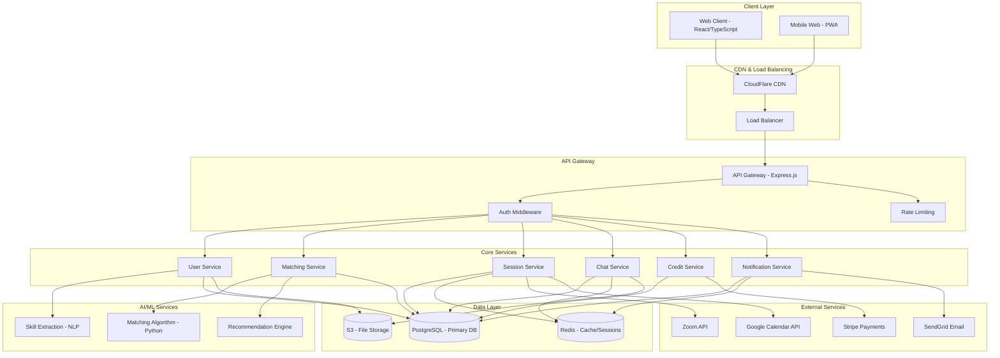

# Design Document

## Overview

The SkillSync Platform Completion design transforms the existing React frontend prototype into a comprehensive peer-to-peer learning exchange platform. The design follows a microservices architecture with AI-powered matching, real-time communication, integrated video sessions, and a gamified credit economy. The platform emphasizes trust, quality, and user engagement through progressive skill verification, community-driven learning circles, and sophisticated matching algorithms.

## Architecture

### High-Level System Architecture



### Technology Stack

**Frontend:**

- React 18 with TypeScript
- Vite for build tooling
- Tailwind CSS for styling
- Framer Motion for animations
- React Router for navigation
- Socket.io client for real-time features
- React Query for data fetching and caching

**Backend:**

- Node.js with Express.js and TypeScript
- PostgreSQL with Prisma ORM
- Redis for caching and session management
- Socket.io for real-time communication
- JWT for authentication
- Stripe for payment processing

**Infrastructure:**

- Docker containers for development and deployment
- CloudFlare CDN for static assets
- AWS/GCP for hosting and storage
- CI/CD pipeline with automated testing

## Components and Interfaces

### Core Data Models

```typescript
// User Model
interface User {
  id: string;
  email: string;
  firstName: string;
  lastName: string;
  avatar?: string;
  bio?: string;
  location?: string;
  timezone: string;
  isVerified: boolean;
  rating: number;
  totalSessions: number;
  joinedAt: Date;
  lastActive: Date;
  skills: UserSkill[];
  availability: Availability[];
  preferences: UserPreferences;
}

// Skill Model
interface Skill {
  id: string;
  name: string;
  category: SkillCategory;
  description?: string;
  isActive: boolean;
}

interface UserSkill {
  id: string;
  userId: string;
  skillId: string;
  proficiencyLevel: ProficiencyLevel; // 0-100
  canTeach: boolean;
  wantsToLearn: boolean;
  isVerified: boolean;
  verificationCount: number;
  skill: Skill;
}

// Session Model
interface Session {
  id: string;
  teacherId: string;
  learnerId: string;
  skillId: string;
  title: string;
  description?: string;
  scheduledAt: Date;
  duration: number; // minutes
  status: SessionStatus;
  type: SessionType;
  videoLink?: string;
  creditCost: number;
  teacher: User;
  learner: User;
  skill: Skill;
  ratings?: SessionRating[];
}

// Message Model
interface Message {
  id: string;
  conversationId: string;
  senderId: string;
  content: string;
  type: MessageType;
  attachments?: Attachment[];
  sentAt: Date;
  readAt?: Date;
  editedAt?: Date;
}

// Credit Transaction Model
interface CreditTransaction {
  id: string;
  userId: string;
  type: TransactionType;
  amount: number;
  description: string;
  sessionId?: string;
  stripePaymentId?: string;
  createdAt: Date;
}
```

### API Endpoints

**Authentication & Users:**

```
POST /api/auth/register
POST /api/auth/login
POST /api/auth/refresh
POST /api/auth/logout
POST /api/auth/forgot-password
POST /api/auth/reset-password

GET /api/users/profile
PUT /api/users/profile
GET /api/users/:id
PUT /api/users/preferences
DELETE /api/users/account
```

**Skills Management:**

```
GET /api/skills
GET /api/skills/categories
POST /api/skills/request
GET /api/users/:id/skills
POST /api/users/skills
PUT /api/users/skills/:id
DELETE /api/users/skills/:id
POST /api/users/skills/:id/verify
```

**Matching & Discovery:**

```
GET /api/matches/suggestions
POST /api/matches/filter
POST /api/matches/:id/favorite
POST /api/matches/:id/pass
POST /api/matches/:id/block
GET /api/matches/favorites
```

**Sessions:**

```
GET /api/sessions
POST /api/sessions
GET /api/sessions/:id
PUT /api/sessions/:id
DELETE /api/sessions/:id
POST /api/sessions/:id/join
POST /api/sessions/:id/rate
GET /api/sessions/upcoming
GET /api/sessions/history
```

**Messaging:**

```
GET /api/conversations
GET /api/conversations/:id
POST /api/conversations
GET /api/conversations/:id/messages
POST /api/conversations/:id/messages
PUT /api/messages/:id
DELETE /api/messages/:id
POST /api/conversations/:id/files
```

**Credits & Payments:**

```
GET /api/credits/balance
GET /api/credits/transactions
POST /api/credits/purchase
POST /api/credits/transfer
GET /api/payments/methods
POST /api/payments/methods
DELETE /api/payments/methods/:id
```

**Notifications:**

```
GET /api/notifications
PUT /api/notifications/:id/read
PUT /api/notifications/read-all
GET /api/notifications/preferences
PUT /api/notifications/preferences
```

### Real-Time Events

**Socket.io Events:**

```typescript
// Client to Server
interface ClientEvents {
  join_conversation: (conversationId: string) => void;
  leave_conversation: (conversationId: string) => void;
  send_message: (data: SendMessageData) => void;
  typing_start: (conversationId: string) => void;
  typing_stop: (conversationId: string) => void;
  join_session: (sessionId: string) => void;
  session_update: (data: SessionUpdateData) => void;
}

// Server to Client
interface ServerEvents {
  message_received: (message: Message) => void;
  message_updated: (message: Message) => void;
  typing_indicator: (data: TypingData) => void;
  user_online: (userId: string) => void;
  user_offline: (userId: string) => void;
  notification: (notification: Notification) => void;
  session_reminder: (session: Session) => void;
  match_suggestion: (match: MatchSuggestion) => void;
}
```

## Data Models

### Database Schema

**Users Table:**

```sql
CREATE TABLE users (
  id UUID PRIMARY KEY DEFAULT gen_random_uuid(),
  email VARCHAR(255) UNIQUE NOT NULL,
  password_hash VARCHAR(255) NOT NULL,
  first_name VARCHAR(100) NOT NULL,
  last_name VARCHAR(100) NOT NULL,
  avatar TEXT,
  bio TEXT,
  location VARCHAR(255),
  timezone VARCHAR(50) NOT NULL DEFAULT 'UTC',
  is_verified BOOLEAN DEFAULT FALSE,
  rating DECIMAL(3,2) DEFAULT 0.00,
  total_sessions INTEGER DEFAULT 0,
  credit_balance INTEGER DEFAULT 50,
  joined_at TIMESTAMP DEFAULT NOW(),
  last_active TIMESTAMP DEFAULT NOW(),
  created_at TIMESTAMP DEFAULT NOW(),
  updated_at TIMESTAMP DEFAULT NOW()
);
```

**Skills Table:**

```sql
CREATE TABLE skills (
  id UUID PRIMARY KEY DEFAULT gen_random_uuid(),
  name VARCHAR(255) NOT NULL,
  category VARCHAR(100) NOT NULL,
  description TEXT,
  is_active BOOLEAN DEFAULT TRUE,
  created_at TIMESTAMP DEFAULT NOW()
);

CREATE TABLE user_skills (
  id UUID PRIMARY KEY DEFAULT gen_random_uuid(),
  user_id UUID REFERENCES users(id) ON DELETE CASCADE,
  skill_id UUID REFERENCES skills(id) ON DELETE CASCADE,
  proficiency_level INTEGER CHECK (proficiency_level >= 0 AND proficiency_level <= 100),
  can_teach BOOLEAN DEFAULT FALSE,
  wants_to_learn BOOLEAN DEFAULT FALSE,
  is_verified BOOLEAN DEFAULT FALSE,
  verification_count INTEGER DEFAULT 0,
  created_at TIMESTAMP DEFAULT NOW(),
  UNIQUE(user_id, skill_id)
);
```

**Sessions Table:**

```sql
CREATE TABLE sessions (
  id UUID PRIMARY KEY DEFAULT gen_random_uuid(),
  teacher_id UUID REFERENCES users(id) ON DELETE CASCADE,
  learner_id UUID REFERENCES users(id) ON DELETE CASCADE,
  skill_id UUID REFERENCES skills(id),
  title VARCHAR(255) NOT NULL,
  description TEXT,
  scheduled_at TIMESTAMP NOT NULL,
  duration INTEGER NOT NULL, -- minutes
  status VARCHAR(50) DEFAULT 'pending',
  type VARCHAR(50) DEFAULT 'one-time',
  video_link TEXT,
  credit_cost INTEGER NOT NULL,
  created_at TIMESTAMP DEFAULT NOW(),
  updated_at TIMESTAMP DEFAULT NOW()
);
```

### Enums and Types

```typescript
enum ProficiencyLevel {
  BEGINNER = "beginner", // 0-25%
  INTERMEDIATE = "intermediate", // 26-60%
  ADVANCED = "advanced", // 61-85%
  EXPERT = "expert", // 86-100%
}

enum SessionStatus {
  PENDING = "pending",
  CONFIRMED = "confirmed",
  IN_PROGRESS = "in_progress",
  COMPLETED = "completed",
  CANCELLED = "cancelled",
  NO_SHOW = "no_show",
}

enum SessionType {
  ONE_TIME = "one_time",
  RECURRING = "recurring",
  LEARNING_CIRCLE = "learning_circle",
  MICRO_LEARNING = "micro_learning",
}

enum MessageType {
  TEXT = "text",
  FILE = "file",
  IMAGE = "image",
  SYSTEM = "system",
}

enum TransactionType {
  EARNED = "earned",
  SPENT = "spent",
  PURCHASED = "purchased",
  REFUNDED = "refunded",
  BONUS = "bonus",
}
```

## Error Handling

### Error Response Format

```typescript
interface ApiError {
  success: false;
  error: {
    code: string;
    message: string;
    details?: any;
    timestamp: string;
    requestId: string;
  };
}

interface ApiSuccess<T> {
  success: true;
  data: T;
  meta?: {
    pagination?: PaginationMeta;
    timestamp: string;
    requestId: string;
  };
}
```

### Error Categories

**Authentication Errors (401):**

- `AUTH_TOKEN_INVALID`: Invalid or expired JWT token
- `AUTH_TOKEN_MISSING`: No authentication token provided
- `AUTH_CREDENTIALS_INVALID`: Invalid email/password combination
- `AUTH_ACCOUNT_LOCKED`: Account temporarily locked due to failed attempts

**Authorization Errors (403):**

- `AUTH_INSUFFICIENT_PERMISSIONS`: User lacks required permissions
- `AUTH_RESOURCE_FORBIDDEN`: Access to specific resource denied
- `AUTH_ACCOUNT_SUSPENDED`: Account has been suspended

**Validation Errors (400):**

- `VALIDATION_REQUIRED_FIELD`: Required field missing
- `VALIDATION_INVALID_FORMAT`: Field format is invalid
- `VALIDATION_CONSTRAINT_VIOLATION`: Business rule constraint violated

**Resource Errors (404/409):**

- `RESOURCE_NOT_FOUND`: Requested resource doesn't exist
- `RESOURCE_ALREADY_EXISTS`: Resource with same identifier exists
- `RESOURCE_CONFLICT`: Resource state conflict

**Business Logic Errors (422):**

- `INSUFFICIENT_CREDITS`: User doesn't have enough credits
- `SESSION_BOOKING_CONFLICT`: Time slot already booked
- `SKILL_VERIFICATION_FAILED`: Skill verification requirements not met

## Testing Strategy

### Testing Pyramid

**Unit Tests (70%):**

- Business logic functions
- Utility functions
- Data validation
- Algorithm implementations
- Individual component behavior

**Integration Tests (20%):**

- API endpoint testing
- Database operations
- External service integrations
- Real-time communication flows
- Authentication flows

**End-to-End Tests (10%):**

- Critical user journeys
- Cross-browser compatibility
- Mobile responsiveness
- Performance benchmarks

### Testing Tools and Frameworks

**Backend Testing:**

- Jest for unit and integration tests
- Supertest for API testing
- Testcontainers for database testing
- MSW for mocking external APIs

**Frontend Testing:**

- Vitest for unit tests
- React Testing Library for component tests
- Playwright for E2E tests
- Storybook for component documentation

### Test Coverage Requirements

- Minimum 80% code coverage for backend services
- Minimum 70% code coverage for frontend components
- 100% coverage for critical business logic (credit transactions, matching algorithm)
- All API endpoints must have integration tests
- All user-facing features must have E2E tests
